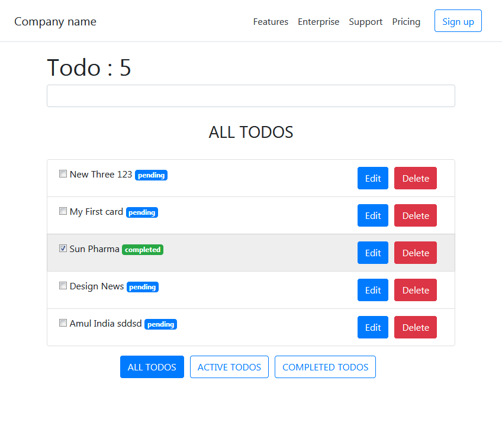

# react-todo-app
React Todo app using Webpack, Babel, Express.js and NeDB

#Install
Download or clone this repository

Run "npm install" command

Open command prompt and run "npm run start" and in another command prompt "npm run webpack"

#Screenshot

